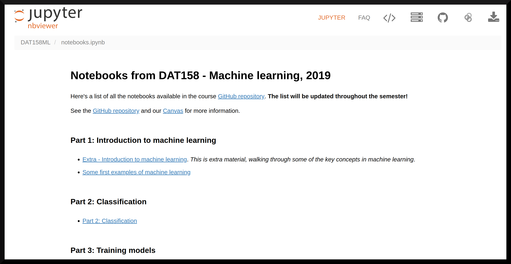

# DAT158ML
This is the repo of the course repo for the 2019 version of [DAT158: Machine learning and advanced algorithms](https://www.hvl.no/en/studies-at-hvl/study-programmes/course/dat158) at HVL. It contains code and documentation for the machine learning part of DAT158. Go to [Canvas](https://hvl.instructure.com/courses/9086) for information about the course.

**Go to [Set up your computer](setup.md) to get started**

To browse through the course notebooks non-interactively, use jupyter.org's nbviewer by clicking [here](https://nbviewer.jupyter.org/github/alu042/DAT158ML/blob/master/notebooks.ipynb).

 (Simply clicking on the notebooks in the repository will display them using GitHubs notebook viewer, but that's typically slower, prone to time-outs and less nice than nbviewer.)

To browse through the notebooks **interactively**, without having to install any software, you can use our Binder:

 

# Notebooks
The course is based on Jupyter Notebook, a web-based framework to write and present code-based projects. Have a look at https://youtu.be/HW29067qVWk and https://youtu.be/2eCHD6f_phE for short introductions to Jupyter Notebooks.

Throughout the course you will work with notebooks containing various material and coding exercises. _It is recommended to make copies of the course notebooks before editing_. You can follow the naming convention `my_[name_of_original_notebook].ipynb`.

# Get started
* Go thorugh the instructions at [Set up your computer](setup.md)
* [Python, Numpy, Pandas, Matplotlib, Scikit-learn](0.0-test.ipynb): clone the repository and run through this notebook locally to test whether your software environment is correctly set up. 
